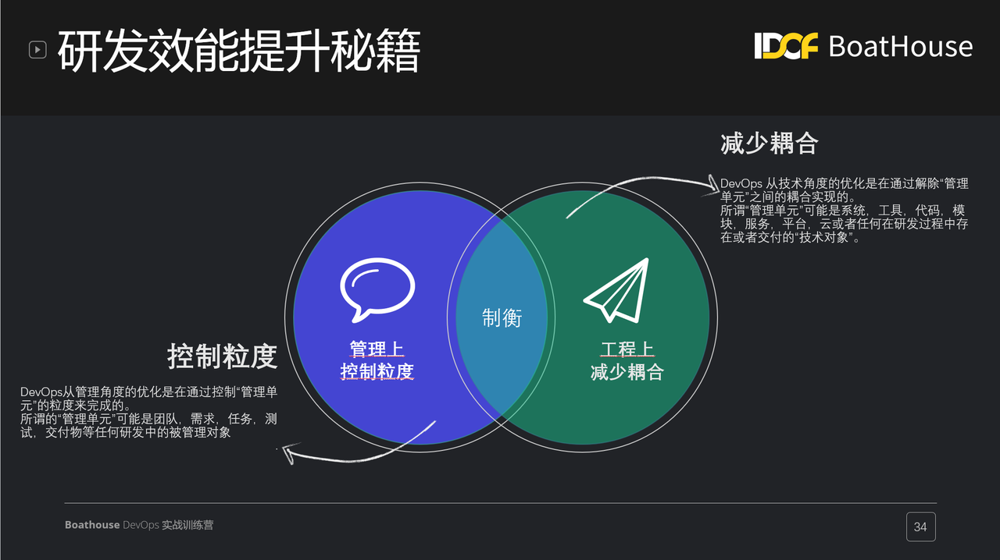
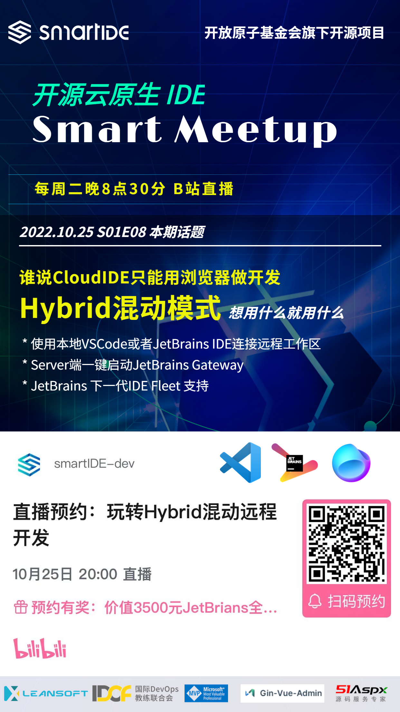

一直都想写这样一篇文章来聊一聊我对软件工程的看法，粗略算来我从事软件工程这件事情已经将近18个年头。很多人并不理解软件工程和软件开发的区别，用一个简单的类比来说明一下：如果说软件开发人员是淘金者，那么从事软件工程的人员就是卖牛仔裤的。是的，软件工程就是为软件开发人员提供最好的方法，工具和实践的学科。要做好软件工程这件事情首先要做的就是要理解到底什么是软件开发，也就是说软件工程的从业者必须对自己所服务的对象有正确理解，才能摸清其中的规律，从而为软件开发人员提供符合自然规律的方法，工具和实践 --- 这个所谓的规律就是我今天想跟大家聊的内容：软件工程的第一性原理。

第一性原理这个词被埃隆马斯克带火了，其基本含义就是事物的根本性规律，马斯克经常说自己对物理学很痴迷就是因为物理其实研究的就是世间万物的根本性规律，从这个规律出发所做出的判断和决策就是符合规律的，也是一定可以实现的。相反，如果做不符合规律的事情，那么结果被各种困境缠绕，无法脱身。所谓的适者生存，就是这样一个简单的道理。

但是，规律的做法不一定就是简单方便的做法，事实上一般的情况恰恰相反，符合自然规律的做法往往都更加困难，违背基本的人性。举个简单例子，我们都知道要获得健康的身体就要坚持规律的作息，持续的锻炼身体并且科学的饮食；而实际的情况是我们总有理由去熬夜，总会在计划好的锻炼时间偷懒，高糖高碳水的冰淇淋和蛋糕也永远比蔬菜沙拉更加吸引我们，这就是人性。

## 软件第一性原理第一定律：软件是虚拟的

软件是一个虚拟物品，这就是软件工程的第一性原理，认识到这一点你才能真正理解精益敏捷、理解DevOps和持续交付，理解研发效能，理解平台工程，理解任何为了软件而存在的方法，工具和实践。
等等，软件是一个虚拟物品，这不是废话吗？是的，只有符合自然规律的描述才能被称之为废话，因为这个第一性原理本来就不神秘，本来就在你的身边。这就好像牛顿的力学定律一样，说出来你也会觉得是废话，但是真的要把它解释清楚，那么你就成为牛顿了。是的，你和牛顿的距离就是一句废话。

### 地下室的故事

话说一家知名的房地产大厂有一位具备500年房地产从业经验的设计师，他设计大楼的经验年头甚至都比大楼存在的时间要长那么几十年，唯一的问题是这些设计师是个盲人。有一次这位设计师来到一座将要竣工的大楼面前，这座楼有50多层，已经进入到内装修阶段了。设计师在仔细检查了大楼的各项设施之后提出了自己专业的意见，这个大楼需要增加2层地下室。

你一定可以想象在场的项目经理，施工方和工人们惊吓的目光，感觉自己遇到了一个疯子。不过，类似的场景其实只是各个软件/互联网大厂的日常而已吧，这样的疯子每天都见，早就习惯了。

### 疯子错了吗？

当然没有，他只是发现了一个“底层”问题，但是并没有意识到这是个“底层”问题，因为他根本看不到这栋大楼。这就是软件，一个虚拟的大楼。

作为程序员，大家都懂软件的分层，数据/逻辑/界面这是基本的三层架构；实际中的软件往往比这要复杂的多。但是如果你尝试去给普通人解释，这将是一件非常有挑战的工作，恐怕要从Hello World讲起。

因为软件本身是一件虚拟物品，普通人很难通过常识判断软件的复杂性以及内部关系，造成严重的信息不对称，这是软件工程领域各种问题的原罪。

## 软件第一性原理第二定律：软件只能被制造一次

复制一款软件和复制一辆汽车的成本是完全不同的，这也是基于第一定律延续。复制一辆汽车需要从新投入原材料，人工和各种生产资料，但是复制一款软件只需要Ctrl-C加Ctrl-V就够了。软件开发团队所做的事情严格来说不是生产制造软件，而是在设计软件，因为生产制造是指重复产出同样的产品，而软件开发团队每次产出的都是不一样的产品。

### 瀑布模式就是个错误

设计是一项创造性活动，创造性活动的目标是无法被预先定义的，其最大的风险是创造了无用的产品，如果方向错了，所有的努力都只会加速死亡。既然生死未知，计划的意义何在，你在计划更好的生，还是计划更快的死？现实中的表现是软件经常延期，工作量估算不准确，开发过程经常遇到不可见问题，轻则延期重则推翻重做。这也是瀑布式开发模式为什么从根本上就是错的，瀑布式开发的一个基本假设就是目标是确定的。

既然瀑布本身就是错误，为什么仍然有那么多组织和团队仍然在使用这种模式呢？其实在本文一开始已经解释了原因，这就是蔬菜沙拉和奶油蛋糕的区别。瀑布模式虽然不符合软件工程的基本规律，但是它更加符合懒惰和规避变化的人性特点，因此大家会不自觉的选择奶油蛋糕。如果再考虑组织中僵化的流程，官僚的氛围以及各种利益的驱使因素，那么瀑布这种更加容易管理，更省心轻松的方式自然会受到欢迎，至于产出的软件是否有用，是否浪费了资源，开发人员是否痛苦不堪，这些都不重要。当然，前提是这个组织本身不依赖软件生存，对于一个数字化的组织或者强烈依赖软件运作的组织而言，产出无用的软件这一点就已经足够驱动他们选择蔬菜沙拉了。事实上，那些选择了奶油蛋糕的早就死于高血脂引起的心血管疾病和脑梗了。

### 敏捷只是个标签

倡导迭代式的敏捷开发模式为什么现在被大多数开发团队认可，原因就是敏捷从根本上承认了软件开发目标的不确定性，而不像瀑布模式那样非要去定义一个无法被定义的东西。精益思想里面的核心Build-Measure-Learn强调的也是在目标不确定的前提下，怎样通过不断的检视来识别问题，调整方向，最终达到目标。DevOps的三步工作法 1）建立流和系统化思维 2）建立反馈 3）建立持续实验和学习的文化，看上去是不是也异曲同工？这些方法和实践都诞生于软件工程领域，现在已经在很多非软件行业使用，其思想根基都是以上所述的软件第一性原理，都是为了应对客观规律而被总结出来，又在实际工作中被验证的方法。

## 软件工程的基本工作思路 - 粒度和解耦

软件这件事情，现在变得越来越重要。现在火热的所谓数字化，研发效能，平台工程，其根本都是在寻找最大化软件价值的方法而已，只不过关注的层面有所不同。数字化更加关注用户侧和业务价值，研发效能更加关注开发过程，而平台工程则强调用一个内部开发者平台（Internal Developer Platform, IDP）来承载具体的方法和实践。
1993年，被称为是互联网点火人的马克安德森（Marc Andreessen ）开发出了Mosaic浏览器，后来加入网景（Netscape）公司，开创了互联网时代。可以说，软件这件事情只有到了互联网出现以后才真正开始进入普通人的生活。2011年，马克安德森提出了 软件正在吞噬世界（software is eating the world） 的说法，同一年的1月21日腾讯推出了一款为智能终端提供的即时通讯软件，叫做微信。

随着软件规模的不断扩大，早期几个人就可以搞定的软件现在需要几百上千人协同完成，软件开发过程本身的问题也被放大，变成了影响组织生存发展的大问题。
从研发效能的层面，从软件第一性原理出发，我们需要确保在目标不确定，方法不确定，系统越来越复杂的前提下帮助企业取得成功，其基本思路只有2个：就是粒度和解耦。面对不确定目标最简单的应对方式就是将复杂问题简单化，对问题进行拆解，然后逐个攻克。 但是在拆解的过程中会带来一个副作用就是拆解后的单个问题确实简单了，但是问题的数量增加引起问题之间的依赖的副作用。因此我们需要解耦，采用各种管理和技术手段，让拆解后的问题可以被独立解决，而不是依赖其他问题。有关粒度和解耦的话题，请参考我的另外一篇文章 [DevOps实施落地的2大法宝——粒度&解耦](https://mp.weixin.qq.com/s/B-FADBdsz338l3MyX2Abqg)

解耦是一个非常难的话题，在软件工程领域，对这个问题的解决方式就是 基础设施即代码 （Infrastructure as Code, IaC）,IaC本身看上去是一个纯粹的工程方法/工具，实际其背后隐含了一个重要逻辑，就是如果要降低AB系统耦合，就要从他们依赖中提取共性，然后由第三方C来解决这个问题，如下图：

如果想详细了解IaC的概念以及落地方法，请参考我的另外一篇博客 [没有使用IaC的DevOps系统都是耍流氓](/zh/blog/2022-1010-iac/) 。

软件工程随着软件在我们生活中变得日益重要而开始引起了越来越多人的关注，这个行业也非常善于创造概念，因此你会听到各种新鲜的词汇，包括在本文中提到的敏捷，精益，DevOps，平台工程，研发效能等等。但只要做的还是软件，就无法背离软件工程第一性原理的2条定律，记住粒度和解耦，落实IaC的工作方法，就一定能找到适合自己的模式，应对好自己的问题，在自己的领域中取得成就。

最后还想说一句话：这些方法都会帮助你登上高峰，但一定不是别人的那座。

---
本周二晚 SmartIDE Meetup 继续
本期话题：谁说CloudIDE就只能用浏览器访问，Hybrid模式远程工作区想用什么就用什么
B站直播预约通道已经开启，现在预约就有机会获得
价值3500元的JetBrains全系列激活码一个和SmartIDET恤2件

