SmartIDE内置了.NET 6开发环境模板，你可以通过一个简单的指令创建带有WebIDE的开发环境，并立即开始编码和调试。


如果你还没有完成SmartIDE安装，请参考 [SmartIDE 安装手册](/zh/docs/install) 安装SmartIDE命令行工具。

> 说明：SmartIDE的命令行工具可以在Windows和MacOS操作系统上运行，对大多数命令来说，操作是完全一致的。本文档中虽然使用的是MacOS上的截图，但是Windows环境的所有日志和工作状态完全一致。对于脚本格式有区别的地方，我们会同时提供2套脚本。


## VSCode

###  1. 创建开发环境

运行以下命令创建.NET 6开发环境：

```shell
# 在 MacOS/Windows 上打开 终端（Terminal）或者 PowerShell 应用
# 执行以下命令
mkdir sample-dotnet-vscode 
cd sample-dotnet-vscode
smartide new dotnet -T vscode
```

运行后的效果如下，通过命令窗口中的日志详细了解SmartIDE的 启动过程，会自动打开浏览器窗口并导航到VSCode界面，输入 

```shell
#检查dotnet sdk 版本
dotnet --version
```

你可以看到dotnet sdk 6.0已经安装完毕。


###  2. 创建ASP.NET Core minimal  web API 项目

基于刚才搭建的环境中已经集成了dotnet sdk，现在只需要打开VS Code编辑器的命令行终端执行如下指令来初始化一个基于 ASP.NET Core 的minimal  web API项目


```shell
# 初始化dotnet minimal web api 项目
dotnet new webapi -minimal -o TodoApi
```


执行成功后Web Api项目已经初始化成功了如下图：


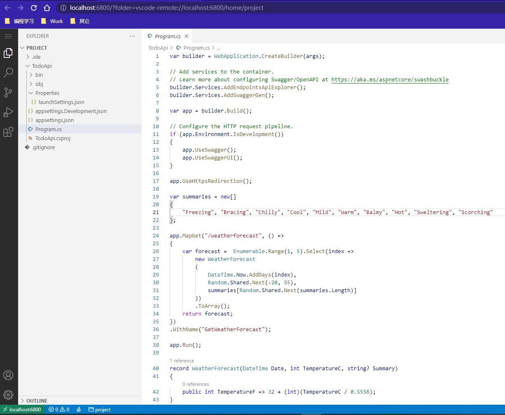


打开VS Code 命令终端执行如下命令安装EntityFrameworkCore工具包：


```shell
# 访问TodoApi项目文件夹
cd TodoApi
# 安装Nuget包（Microsoft.EntityFrameworkCore.InMemory）
dotnet add package Microsoft.EntityFrameworkCore.InMemory
# 安装Nuget包（Microsoft.AspNetCore.Diagnostics.EntityFrameworkCore）
dotnet add package Microsoft.AspNetCore.Diagnostics.EntityFrameworkCore
```


修改Program.cs文件，代码如下：


```C#
using Microsoft.EntityFrameworkCore;

var builder = WebApplication.CreateBuilder(args);

// Add services to the container.
// Learn more about configuring Swagger/OpenAPI at https://aka.ms/aspnetcore/swashbuckle
builder.Services.AddEndpointsApiExplorer();
builder.Services.AddSwaggerGen();
builder.Services.AddDbContext<TodoDb>(opt => opt.UseInMemoryDatabase("TodoList"));
builder.Services.AddDatabaseDeveloperPageExceptionFilter();

var app = builder.Build();

// Configure the HTTP request pipeline.
app.UseSwagger();
app.UseSwaggerUI();

app.MapGet("/", () => "Hello World!");

app.MapGet("/todoitems", async (TodoDb db) =>
    await db.Todos.ToListAsync());

app.MapGet("/todoitems/complete", async (TodoDb db) =>
    await db.Todos.Where(t => t.IsComplete).ToListAsync());

app.MapGet("/todoitems/{id}", async (int id, TodoDb db) =>
    await db.Todos.FindAsync(id)
        is Todo todo
            ? Results.Ok(todo)
            : Results.NotFound());

app.MapPost("/todoitems", async (Todo todo, TodoDb db) =>
{
    db.Todos.Add(todo);
    await db.SaveChangesAsync();

    return Results.Created($"/todoitems/{todo.Id}", todo);
});

app.MapPut("/todoitems/{id}", async (int id, Todo inputTodo, TodoDb db) =>
{
    var todo = await db.Todos.FindAsync(id);

    if (todo is null) return Results.NotFound();

    todo.Name = inputTodo.Name;
    todo.IsComplete = inputTodo.IsComplete;

    await db.SaveChangesAsync();

    return Results.NoContent();
});

app.MapDelete("/todoitems/{id}", async (int id, TodoDb db) =>
{
    if (await db.Todos.FindAsync(id) is Todo todo)
    {
        db.Todos.Remove(todo);
        await db.SaveChangesAsync();
        return Results.Ok(todo);
    }

    return Results.NotFound();
});

app.Run();

class Todo
{
    public int Id { get; set; }
    public string? Name { get; set; }
    public bool IsComplete { get; set; }
}

class TodoDb : DbContext
{
    public TodoDb(DbContextOptions<TodoDb> options)
        : base(options) { }

    public DbSet<Todo> Todos => Set<Todo>();
}
```


继续执行如下命令确保当前项目初始化正确：


```shell
# 编译dotnet TodoApi项目
dotnet build
# 启动dotnet TodoApi项目
dotnet run
```


如果输出结果如下图，说明当前初始化项目能编译通过并且可以正常启动


通过启动项目输出的日志了解当前初始化项目默认设置的端口为7163与5105 与SmartIDE初始化的环境开放的端口不一致，访问.ide文件夹下的.ide.yaml


你会看到端口是可以通过当前文件进行配置的，这里默认开放的端口如下：
- 6822映射容器的22端口用于ssh连接访问
- 6800映射容器的3000端口用于web ide窗口访问
- 5000映射容器的5000端口用于对你当前开发项目的访问


 访问TodoApi项目下的Properties文件夹下的launchSettings.json文件


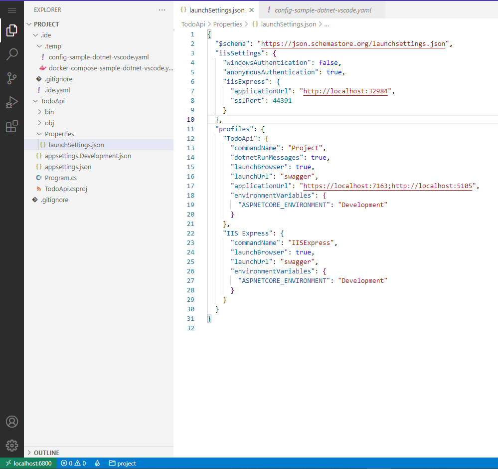


修改 applicationUrl 属性如下：


```json
"applicationUrl": "http://0.0.0.0:5000",
```


由于localhost指的是127.0.0.1是一个回环地址，这个地址发出去的信息只能被自己接受，所以宿主机是无法通过这个IP地址访问进来的，0.0.0.0表示的是所有的IPV4地址，如果当前的宿主机有多个IP地址，并且0.0.0.0开放了5000端口，那么该端口均可以被这些IP访问到，再次启动项目，访问地址 [http://localhost:5000/swagger](http://localhost:5000/swagger) 如下图：


###  3. 开发调试

通过之前的操作我们已经可以对项目进行编译运行的操作了，想要对当前项目进行调试操作还需要做额外配置，点击 VS Code 的 Run and Debug 中的 create a launch.json file 按钮如下图：


点击后并选择 .NET 5+ and .NET Core，执行完上述操作后会创建一个名为.vscode的文件夹里面包含两个文件如下图：


修改 vscode文件夹下的 launch.json 文件中的args属性如下：

```json
 "args": ["--urls","http://0.0.0.0:5000"],
```

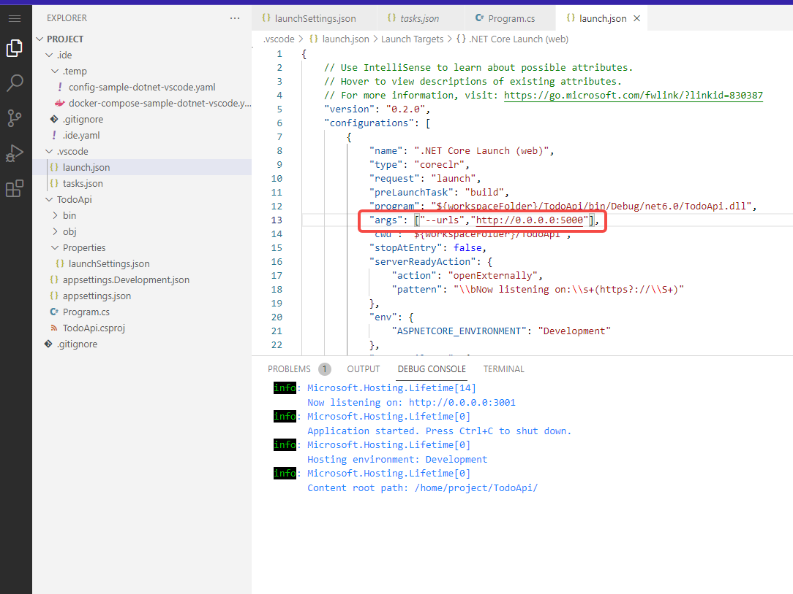

回到 Run and debug 页面点击Run and debug 按钮，VS code会出现 Start Debugging 按钮点击它或者按F5键即可进入该项目的调试模式，如下图：


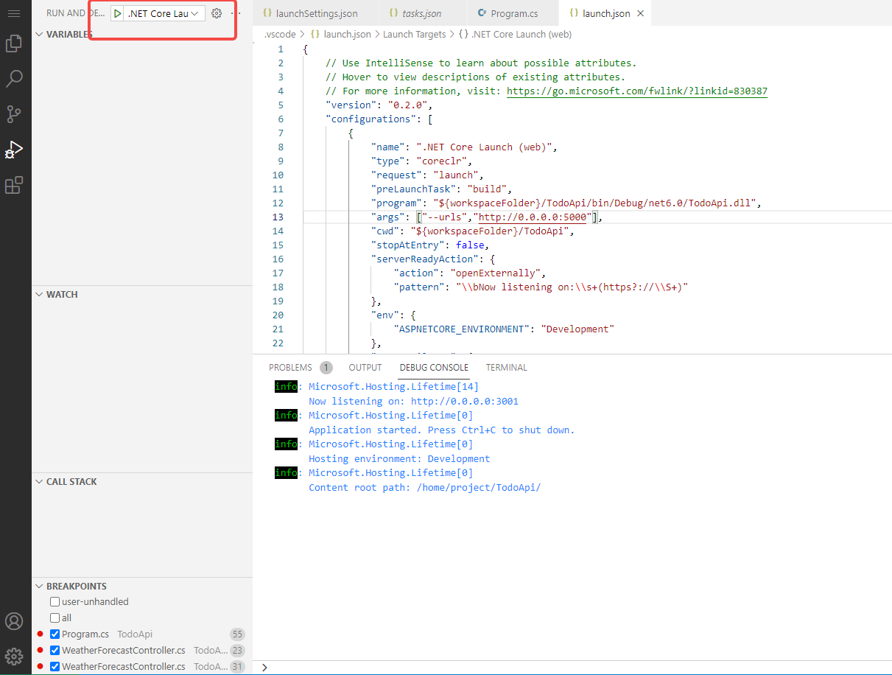

设置调试断点，如下图：


访问swagger页面触发标记断点的api接口，访问 [http://0.0.0.0:5000/](http://0.0.0.0:5000/) 可以看到当前的Http请求停止在了已设置的断点

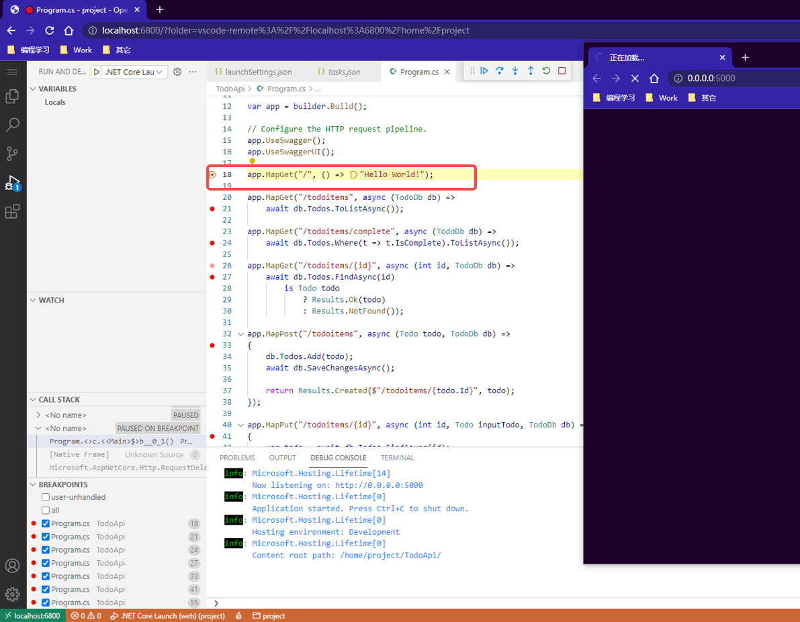


之前添加的代码是通过minimal api 完成的增删改查的操作，触发Post/ todoitems 的api可以完成插入数据的操作如下图：

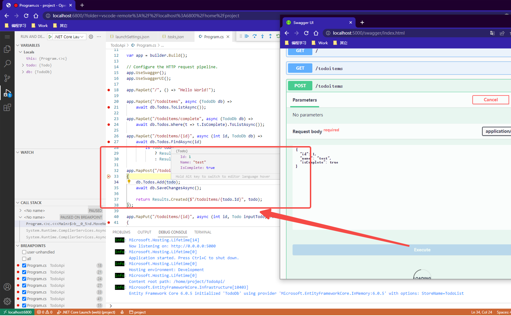

通过触发api Get/ todoitems可以直接查询到之前插入过的数据，如下图：


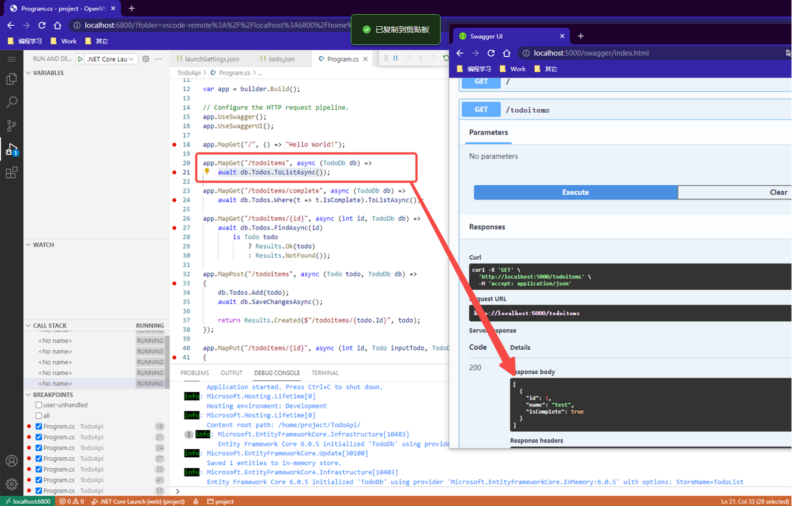


## JetBrains Rider

JetBrains Rider 是由JetBrains公司开发的一个跨平台的.NET IDE工具，不同于VSCode，JetBrains Rider构建.Net 项目并不需要单独配置调试环境

###  1. 新建开发环境

运行以下命令创建基于JetBrains Rider的.Net环境

```shell
mkdir sample-dotnet-rider
cd sample-dotnet-rider
smartide new dotnet -T rider
```

运行后效果如下：

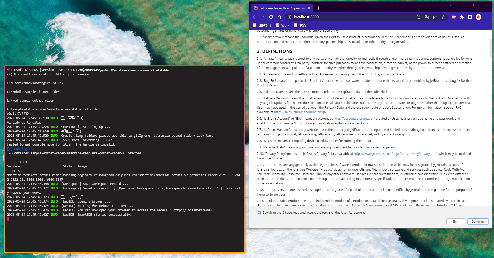

然后根据配置向导逐一完成操作，最终会到配置Licenses的页面如下图：

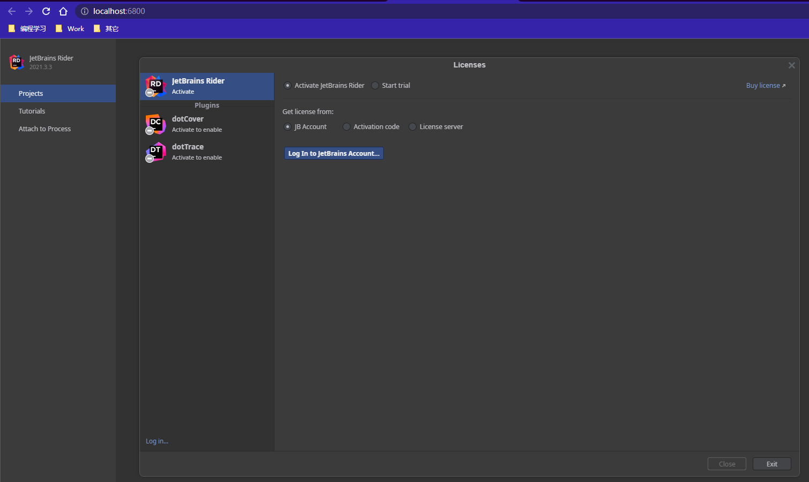

到这里你需要登录你自己的Jetbrains 账号（第一次使用Jetbrains 软件的用户会有一年的免费试用期），配置完如下图：

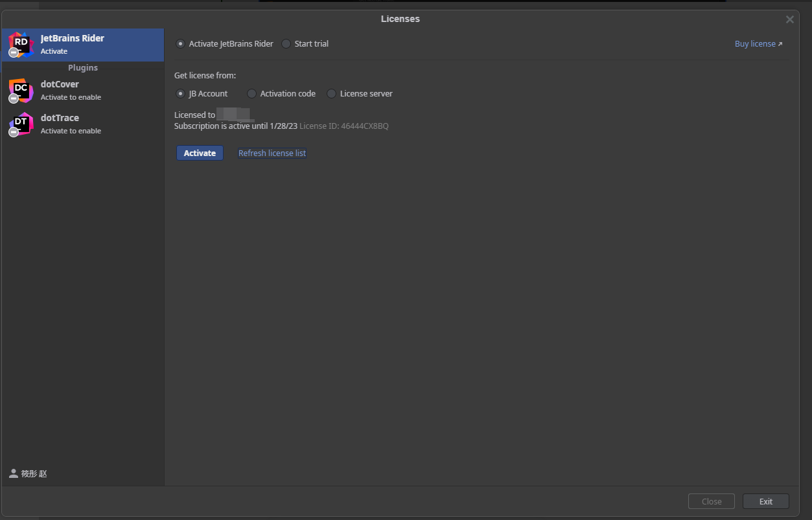

###  2. 创建ASP.NET Core Web Api项目

点击New Solution 选择ASP.NET Core Web Application选项，由于Rider目前并未集成minimal web api类型，因此这里项目类型选择Web Api如下图：

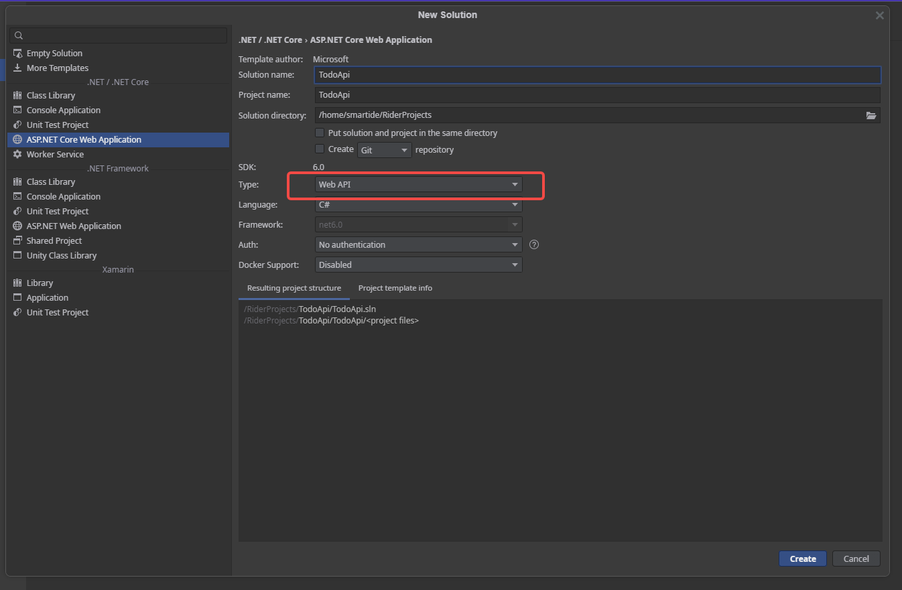

点击create 创建项目，操作完成后如下图：


###  3. 开发调试

编译项目确保默认初始化项目没有问题，点击Build Solution编译项目操作如下图：

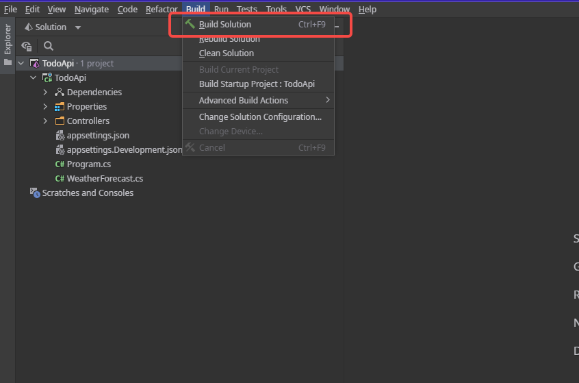

编译成功后如下图：


与配置基于VS Code的.NET 环境一样我们需要确认当前SmartIDE开发环境的配置端口信息，访问宿主机的sample-dotnet-rider文件夹下的.ide文件夹中的.ide.yaml文件如下图：

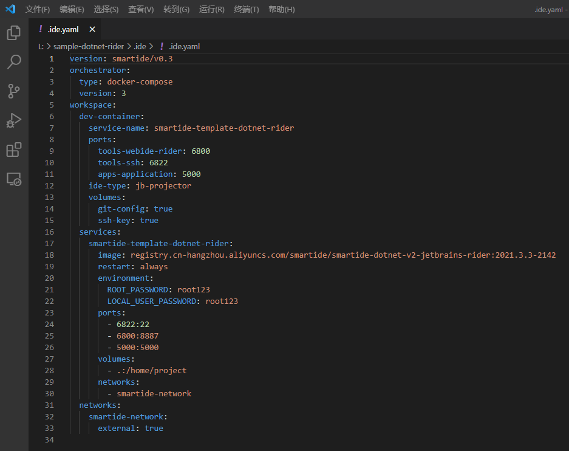

通过ide.yaml文件确认将默认初始化的项目端口设置为5000即可，修改项目中的Properities文件夹中的launchSettings.json文件如下图：


修改 applicationUrl 属性如下：

```json
"applicationUrl": "http://0.0.0.0:5000",
```


修改完成后点击Debug进入调试模式，访问该项目的Swagger页面并触发Api WeatherForecast如下图：

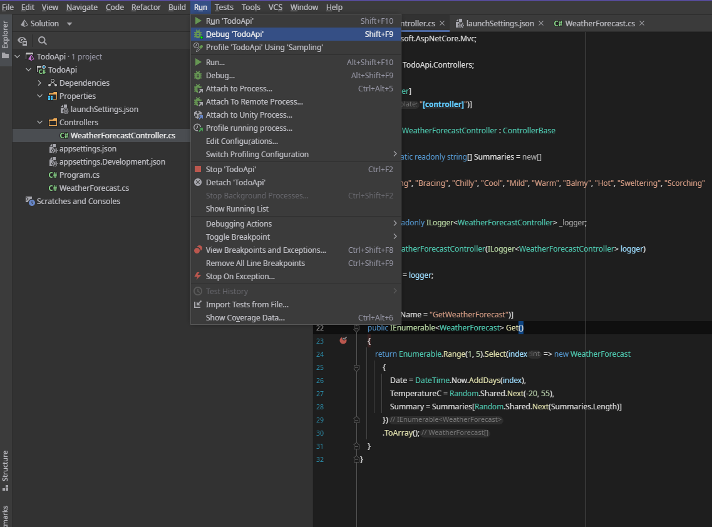

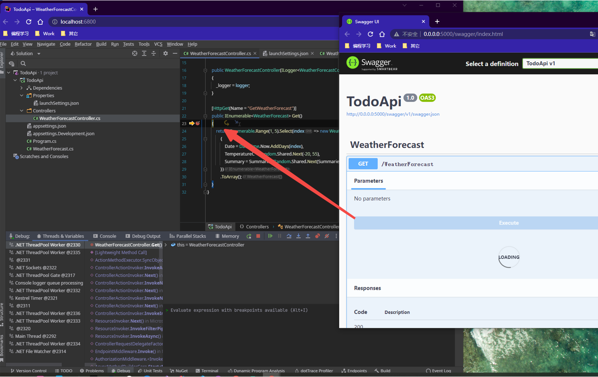


## 远程开发

上面我们已经使用SmartIDE的本地工作区模式完成了一个应用的创建和开发过程，这个过程和你所熟悉的开发模式有2个区别，1）我们使用了WebIDE；2）开发环境全部通过容器获取并运行。

在这个过程中你的项目代码也已经具备了远程开发的能力，你可以按照以下文档中的说明使用任意一种远程工作区来开发调试你的应用

- [远程主机工作区](/zh/docs/overview/remote-workspace/#远程主机工作区)
- [k8s工作区](/zh/docs/overview/remote-workspace/#k8s工作区)
- [Server工作区](/zh/docs/overview/remote-workspace/#server工作区)

另外，你也可以通过VSCode或者JetBrains内置的远程开发模式进行Hybird模式的远程开发，具体请参考

- [IDE远程开发操作手册](/zh/docs/manual/ide-remote/)

---
**感谢您对SmartIDE的支持：Be a Smart Developer，开发从未如此简单。**
